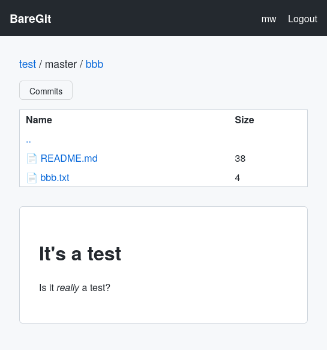

# BareGit

BareGit is a lightweight, self-hosted Git web interface and Smart HTTP
backend built with Python and Flask. It is designed to be simple,
deployment-friendly, and free of heavy frontend frameworks.



## Features

*   **Web Interface**: Browse repositories, view file trees, read rendered READMEs, and inspect commit history.
*   **Git Smart HTTP**: Full support for `git clone`, `git pull`, and `git push` over HTTP(S).
*   **Authentication**:
    *   **Web UI**: OpenID Connect (OIDC) integration (e.g., Keycloak).
    *   **Git Operations**: HTTP Basic Auth with independent, hashed credentials managed via the UI.
*   **Management**: Create new bare repositories and manage user settings directly from the browser.
*   **Lightweight**: Minimal dependencies and clean, semantic HTML and CSS.
*   **Database**: Uses SQLite for simple, zero-configuration data storage.

## Deployment

### Prerequisites

*   Python 3.8+
*   Git (core packages)
*   A `git-http-backend` executable (usually found in `/usr/lib/git-core/` or `/usr/libexec/git-core/`).

### Manual Installation

1.  **Clone the repository**:
    ```bash
    git clone https://github.com/metrowind/baregit.git
    cd baregit
    ```

2.  **Set up environment**:
    ```bash
    python3 -m venv venv
    source venv/bin/activate
    pip install flask requests markdown
    ```

3.  **Configure**:
    Copy the example configuration:
    ```bash
    cp baregit.ini.example baregit.ini
    ```
    Edit `baregit.ini`:
    *   Set `debug = false`.
    *   Set `data_path` to a persistent directory (e.g., `/var/lib/baregit`) for the database and assets.
    *   Set `repo_path` to where you want your Git repositories stored (e.g., `/var/lib/baregit/repos`).
    *   Configure your OIDC provider details.

    **Important**: Copy the `templates/` and `static/` directories to your configured `data_path`.

4.  **Run**:
    ```bash
    python src/app.py --config baregit.ini
    ```

### Arch Linux

A `PKGBUILD` and systemd service file are provided in `packages/arch/`.

1.  Build the package:
    ```bash
    cd packages/arch
    makepkg -si
    ```

2.  Configure:
    Edit `/etc/baregit.ini` with your OIDC settings.

3.  Start the service:
    ```bash
    sudo systemctl enable --now baregit
    ```

### CLI Usage

BareGit includes a CLI for administrative tasks, primarily used for migration or synchronization.

#### Import an existing repository
If you have existing bare repositories already located in your `repo_path` (e.g., from a manual migration), you can bring them into the BareGit database using the `--import-repo` flag.

```bash
python src/app.py --import-repo <folder_name> --owner <username> --config baregit.ini
```
*   **Migration**: Useful when moving repositories from another server. Simply copy the `.git` directories into the configured `repo_path` and run this command for each.
*   **Disk Synchronization**: If a repository exists on the filesystem but is not appearing in the web UI, this command registers it and assigns an owner.
*   **Parameters**:
    *   `<folder_name>`: The name of the directory inside your `repo_path` (e.g., if the folder is `project.git`, use `project`).
    *   `<username>`: The `preferred_username` of the owner (the user must have logged in via the web UI at least once to exist in the database).

## License

WTFPL
